# Examen Final Transversal INY1105 - Infraestructura de Aplicaciones I

Este repositorio contiene el desarrollo de la Evaluación Final Transversal (EFT) de la asignatura **Infraestructura de Aplicaciones I (INY1105)**.

* **Estudiante:** Hugo Cuellar
* **Docente:** Rodrigo Aguilar G.
* **Institución:** Duoc UC
* **Caso de Estudio:** Empresa VZeta - Despliegue de Stack de Servicios Contenerizados

---

## 1. Justificación Técnica

### 1.1. Comparativa de Virtualización: Hipervisores vs. Contenedores
Para optimizar la infraestructura de VZeta, es vital entender las diferencias operativas y de licenciamiento entre la virtualización tradicional y la contenerización:

| Característica | Virtualización Tradicional (Hipervisores) | Contenerización (Docker / Contenedores) |
| --- | --- | --- |
| **Arquitectura** | Cada Máquina Virtual (VM) incluye su propio Sistema Operativo completo (Guest OS), bibliotecas y la aplicación, ejecutándose sobre un Hipervisor (Bare-metal tipo 1 como VMware ESXi / Proxmox, o tipo 2 como VirtualBox). | Los contenedores comparten el núcleo (kernel) del Sistema Operativo Host. Solo empaquetan la aplicación y sus dependencias de usuario directas. |
| **Consumo de Recursos** | **Alto:** Una VM vacía consume gigabytes de RAM y disco solo para inicializar su propio sistema operativo. El overhead de emulación es significativo. | **Bajo:** Consumo de recursos casi nativo. Un contenedor puede pesar pocos megabytes y arrancar en milisegundos. |
| **Instalación y Gestión** | **Compleja:** Requiere instalar el hipervisor, aprovisionar recursos fijos de hardware, instalar el SO invitado, parches de seguridad independientes y herramientas de red complejas. | **Simple:** Se instala Docker Engine en el SO host (`dnf install docker`). A partir de ahí, cualquier imagen se levanta de forma estandarizada. |
| **Licenciamiento** | **Costoso / Rígido:** Licencias basadas en núcleos físicos (ej. Windows Server) o esquemas de suscripción muy costosos tras cambios corporativos (ej. VMware vSphere). | **Abierto / Flexible:** Docker Engine es open-source (Apache 2.0). Existen opciones Enterprise, pero la base comunitaria no incurre en costos de licencia. |
| **Ejemplo Concreto** | Ejecutar un servidor Linux Ubuntu completo consumiendo 1.5 GB de RAM fijos para hostear una pequeña aplicación Flask. | Levantar la misma aplicación Flask en un contenedor Docker compartiendo los recursos dinámicamente con el Host, consumiendo menos de 50 MB de RAM. |

**Para el caso de VZeta:** Docker y Docker Compose se perfilan como la mejor opción debido al bajo consumo de recursos y la rapidez con la que se puede replicar el entorno de desarrollo a producción de manera idéntica.

### 1.2. Propuesta Tecnológica: Entornos de Nube
Considerando los requerimientos de disponibilidad y control de VZeta, analizamos los diferentes esquemas de nube para su despliegue final:

1. **Nube Pública (ej. AWS, Azure, GCP):**
   * *Ventajas:* Alta disponibilidad geográfica, escalabilidad elástica automatizada (pago por uso), nulo mantenimiento de hardware físico.
   * *Desventajas:* Costos variables difíciles de predecir (egreso de datos, peticiones API), dependencia estricta de la conectividad y políticas del proveedor.
   * *Caso VZeta:* El despliegue de la instancia EC2 con Docker representa una implementación de Nube Pública muy ágil para prototipos rápidos y pruebas académicas.

2. **Nube Privada (on-premise con Proxmox / OpenStack):**
   * *Ventajas:* Control absoluto sobre los datos físicos, cumplimiento estricto de regulaciones locales de privacidad, costos predecibles a largo plazo (inversión CapEx inicial).
   * *Desventajas:* Requiere personal técnico especializado para mantenimiento del hardware, actualizaciones físicas e infraestructura local (aire acondicionado, energía redundante).

3. **Nube Híbrida (Recomendación Final para VZeta):**

### 1.3. Estrategia de Integración y Despliegue Continuo (CI/CD)
Para garantizar un flujo ágil y profesional, la solución implementa un flujo automatizado a través del script unificado `./VZeta.sh`:
* **Integración Continua (CI):** Todo el código se gestiona de forma centralizada en GitHub. Al iniciar la automatización, se validan los archivos de configuración y se ejecuta una construcción automatizada (`docker build`) de las imágenes locales (`vzeta-myapp_container` y `vzeta-mynginx_container`) a partir de sus respectivos `Dockerfiles` personalizados, evitando compilaciones manuales y garantizando la integridad de cada componente.
* **Despliegue Continuo (CD):** El script automatiza completamente el aprovisionamiento de la infraestructura en la nube (Security Group, reglas de puertos 80/22, e instancia EC2) y realiza la transferencia del stack para levantarlo en paralelo mediante `docker compose up -d` en un solo paso, eliminando la intervención manual y garantizando la repetibilidad del despliegue.

---

## 2. Descripción de la Arquitectura del Stack

El stack está diseñado bajo una arquitectura de microservicios de tres capas aisladas dentro de una red interna de tipo bridge:

```
[ Cliente (Internet) ] 
         │ (HTTP Puerto 80)
         ▼
┌────────────────────────────────────────────────────────┐
│ Instancia EC2 (AWS Learner Lab - Nube Pública)         │
│                                                        │
│   ┌────────────────────────────────────────────────┐   │
│   │ Red Docker (red_vzeta - Driver Bridge)         │   │
│   │                                                │   │
│   │  [ mynginx_container ] (NGINX Reverse Proxy)   │   │
│   │         │ (Redirección interna puerto 5000)    │   │
│   │         ▼                                      │   │
│   │  [ myapp_container ] (Flask - Imagen propia)   │   │
│   │         │ (Conexión interna TCP 5432)          │   │
│   │         ▼                                      │   │
│   │  [ db_container ] (PostgreSQL 16)              │   │
│   │         │                                      │   │
│   └─────────┼──────────────────────────────────────┘   │
│             │ (Persistencia de datos)                  │
│             ▼                                          │
│      [ Directorio Local Host: ./postgres_data ]        │
└────────────────────────────────────────────────────────┘
```

* **Capa 1: Reverse Proxy (`mynginx_container`)**: Expuesto al exterior en el puerto 80 del host. Recibe las peticiones HTTP del cliente y las reenvía internamente al contenedor Flask en `http://myapp_container:5000`.
* **Capa 2: Aplicación (`myapp_container`)**: Servidor web Python con Flask (construido desde el `Dockerfile` personalizado con base `python:3-slim`). Recibe la petición, realiza una consulta a la base de datos para registrar la visita e incrementa el contador de visitas.
* **Capa 3: Base de Datos (`db_container`)**: Motor de base de datos PostgreSQL 16. Utiliza un **Bind Mount** en el host local apuntando a `./postgres_data` para garantizar la persistencia de las visitas acumuladas, aun si los contenedores se destruyen o la instancia EC2 se reinicia.
* **Redes y Almacenamiento (IE 2.4.1)**: Todo el tráfico viaja encriptado/aislado dentro de la red Docker virtual `red_vzeta` usando el driver `bridge`. El almacenamiento se desacopla mediante el bind mount local configurado con permisos seguros de lectura/escritura (`chmod 777`).

---

## 3. Guía de Despliegue Paso a Paso

Para desplegar la solución en AWS, se recomienda ejecutar el script unificado directamente desde **AWS CloudShell** (donde la consola cuenta con credenciales automáticas y preconfiguradas). Para iniciar, clona el repositorio, accede al directorio del proyecto y otorga permisos de ejecución:

```bash
# 1. Clonar el repositorio
git clone https://github.com/hcuellar-cl/iny1105-eft-hugo-cuellar.git

# 2. Acceder al directorio del proyecto
cd iny1105-eft-hugo-cuellar

# 3. Otorgar permisos de ejecución al script unificado
chmod +x VZeta.sh

# 4. Iniciar el portal de despliegue interactivo
./VZeta.sh
```

El script mostrará un menú interactivo con las siguientes opciones:

1. **Desplegar / Despliegue Activo (IP) - Conectar vía SSH:**
   * Si no hay despliegue activo, lanza y aprovisiona la instancia EC2 y el stack de contenedores de forma automatizada en AWS.
   * Si detecta un despliegue activo, muta dinámicamente mostrando la IP pública y permitiendo iniciar la conexión SSH interactiva y automática hacia la máquina remota al seleccionarla.
2. **Limpieza y eliminación despliegue:**
   * Termina la instancia EC2 y elimina el Security Group creado (así como la IP elástica asociada) para liberar recursos en AWS Learner Lab.
3. **Salir**

---

## 4. Evidencias

### 4.1. Evidencia del despliegue usando git clone, permisos y ejecución
Captura de pantalla que demuestra el clonado inicial del repositorio en la terminal, la asignación de permisos de ejecución mediante `chmod +x VZeta.sh` y el inicio de la ejecución del script de automatización interactivo.
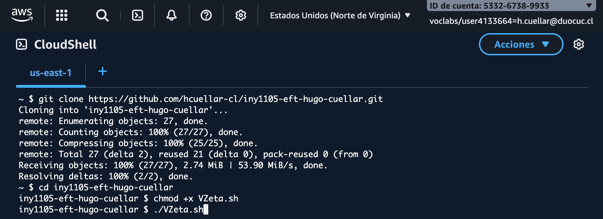

### 4.2. Evidencia script ejecutado con menú interactivo (Mutabilidad)
Captura que muestra la pantalla del menú principal autodetectando de forma dinámica el estado actual del despliegue en tu cuenta de AWS. Se evidencia cómo las opciones cambian dependiendo de la existencia de recursos activos o inactivos.
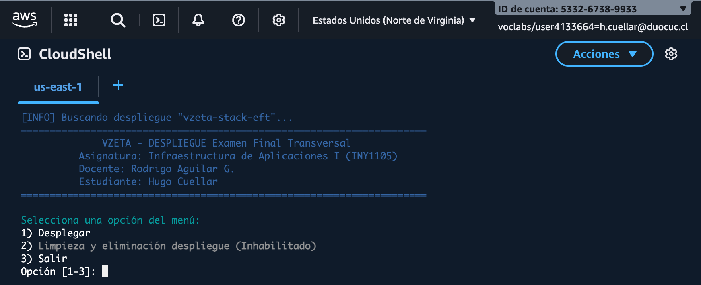

### 4.3. Evidencia de instancia desplegada y habilitación de conexión ssh directa
Captura del proceso de despliegue finalizado de forma exitosa, en donde se aprovisionan el Security Group, las reglas de acceso a puertos (80, 443 y 22), la IP Elástica y se ofrece de forma automática la conexión SSH directa a la instancia.
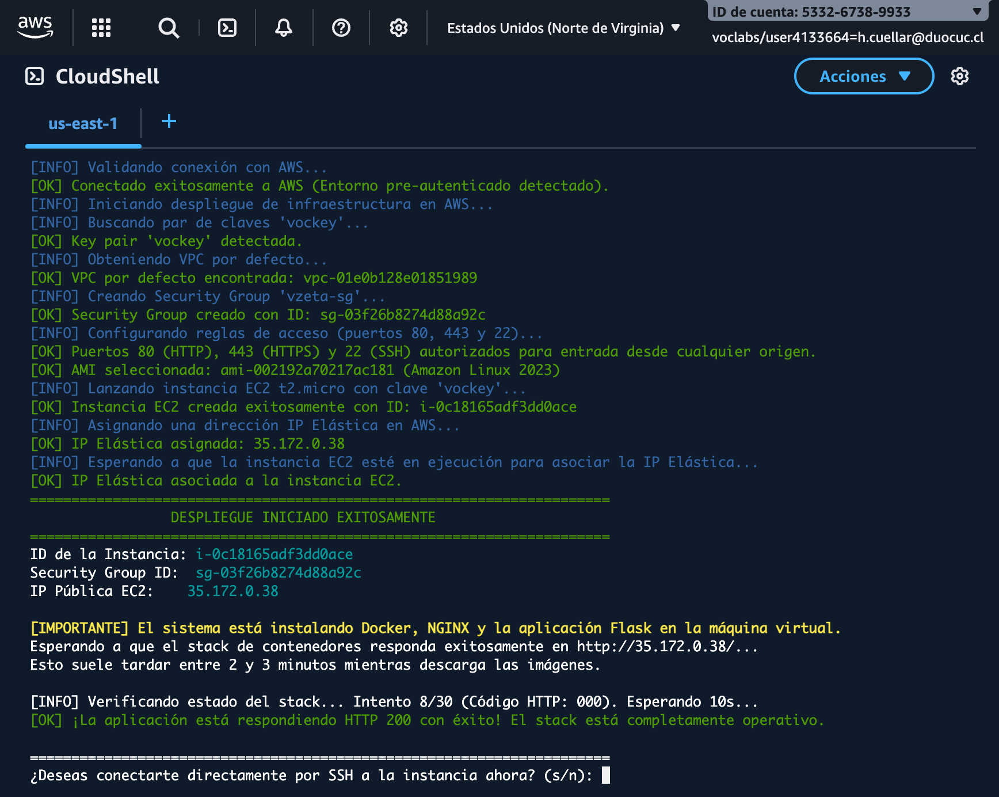

### 4.4. Evidencia conexión a la instancia exitosa
Captura de la consola remota de la máquina virtual EC2 tras establecer la conexión de forma segura y transparente utilizando AWS EC2 Instance Connect.
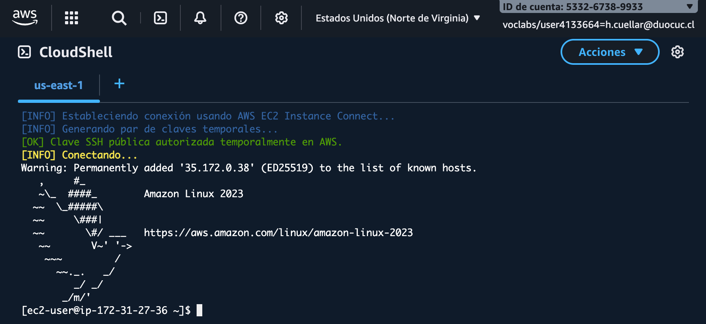

### 4.5. Evidencia ejecución comando `docker --version`
Captura en la que se ejecuta el comando `docker --version` en el host de AWS EC2. Este comando verifica la versión actual del motor de Docker instalado, confirmando que la instalación automatizada realizada por cloud-init finalizó de manera exitosa.
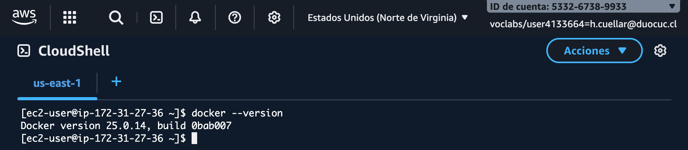

### 4.6. Evidencia ejecución comando `docker images`
Captura en la que se ejecuta el comando `docker images`. Este comando lista todas las imágenes de Docker que se encuentran disponibles localmente en la máquina virtual, evidenciando las imágenes creadas de forma personalizada: `vzeta-myapp_container` (capa de Flask) y `vzeta-mynginx_container` (capa de proxy reverso NGINX).
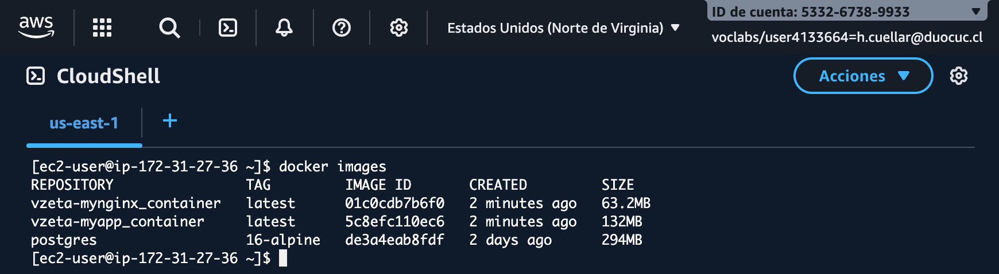

### 4.7. Evidencia ejecución comando `docker ps`
Captura de la ejecución del comando `docker ps`. Este comando lista los contenedores que se están ejecutando actualmente en tiempo real, demostrando el correcto funcionamiento en paralelo y estado saludable (Up) de `db_container`, `myapp_container` y `mynginx_container`.
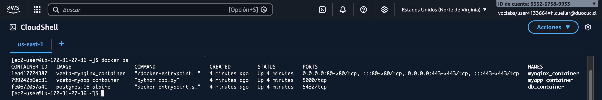

### 4.8. Evidencia ejecución comando `docker inspect db_container`
Captura que muestra la salida del comando `docker inspect db_container`, la cual proporciona información detallada en formato JSON sobre el contenedor de la base de datos, enfocándose en la sección **Mounts** para verificar la correcta configuración del Bind Mount local `./postgres_data` y el driver de red bridge `red_vzeta`.
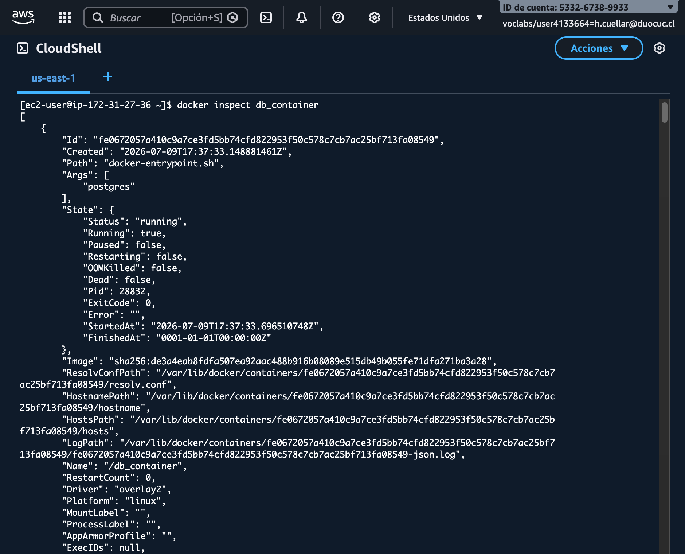

### 4.9. Evidencia ingreso a la URL IP de la instancia en el navegador
Captura del cliente web cargado exitosamente en el navegador web usando la dirección IP pública de la instancia EC2 (con soporte HTTPS en puerto 443), mostrando la aplicación operativa, el contador de visitas registrando visitas, y la conexión exitosa a PostgreSQL.
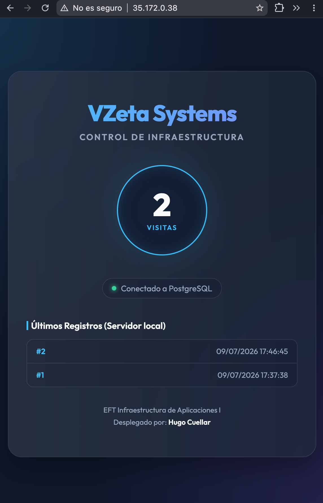

### 4.10. Evidencia ejecución comando `docker-compose restart` y persistencia
Captura de la terminal donde se ejecuta el comando de ciclo de vida `docker compose restart` (reiniciando todo el stack de servicios) y su posterior visualización en el navegador, demostrando que el número de visitas persiste e incrementa en lugar de reiniciarse a 1, lo cual confirma la persistencia de datos del volumen de PostgreSQL.
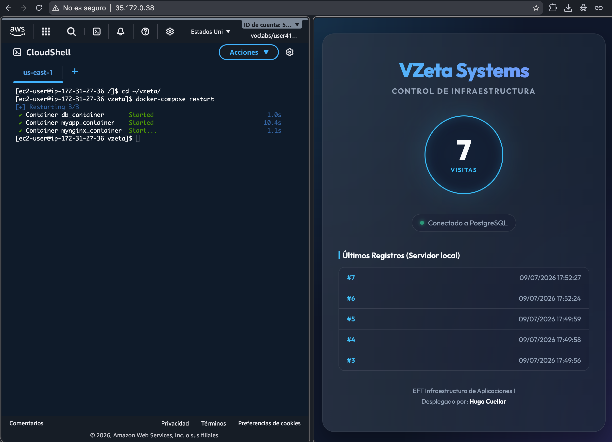

### 4.11. Menú del script mutable al volver de la instancia
Captura que muestra el script interactivo tras salir de la instancia de AWS EC2. El menú principal muta de forma dinámica, actualizando la Opción 1 para mostrar la IP pública activa y permitiendo al usuario ejecutar la limpieza de recursos.
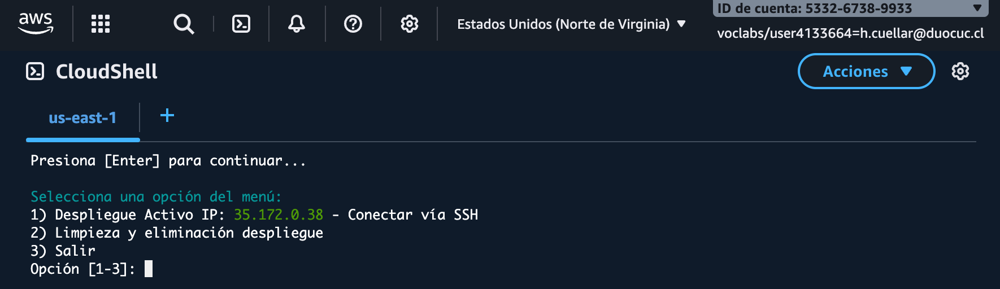
