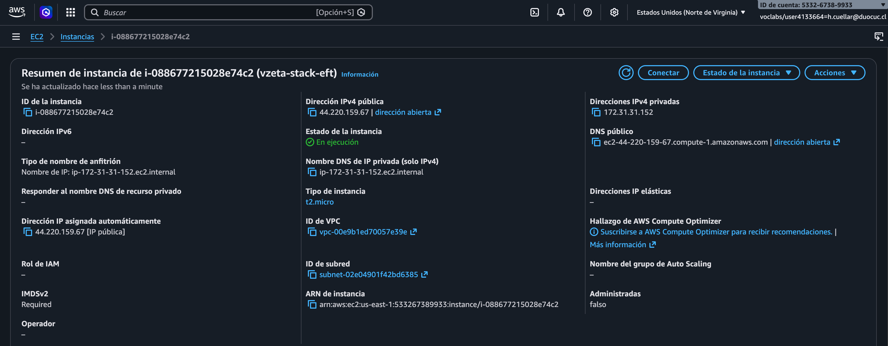
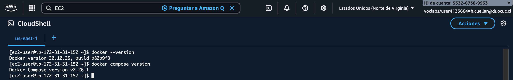
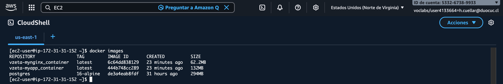
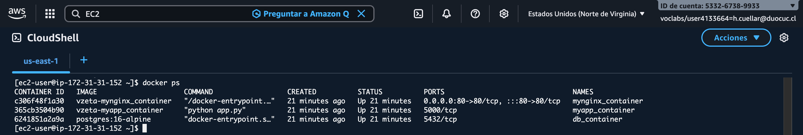
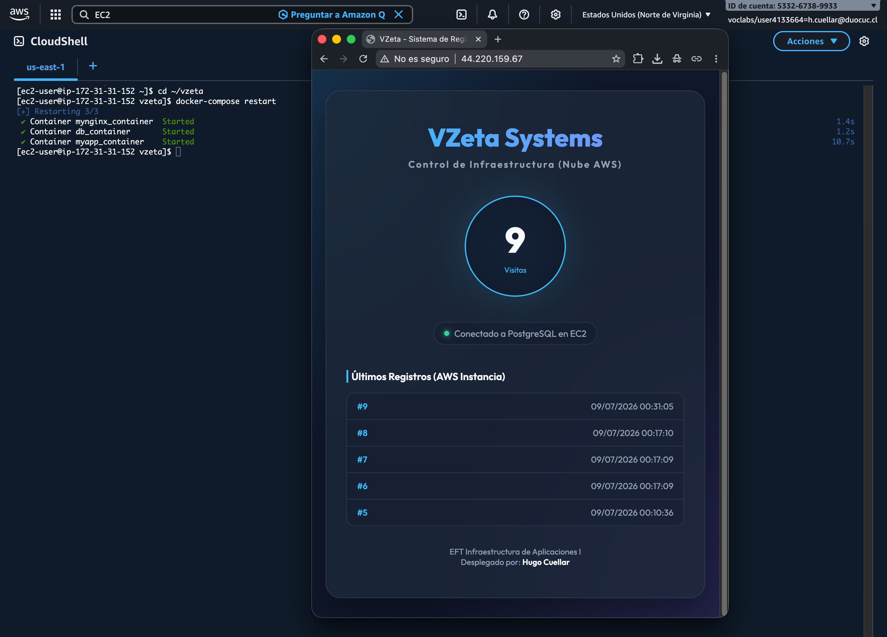
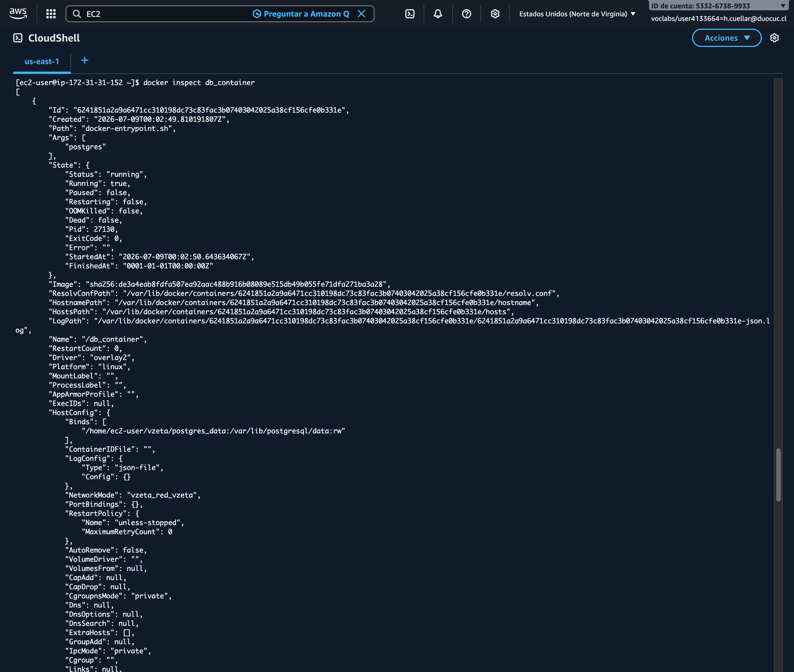
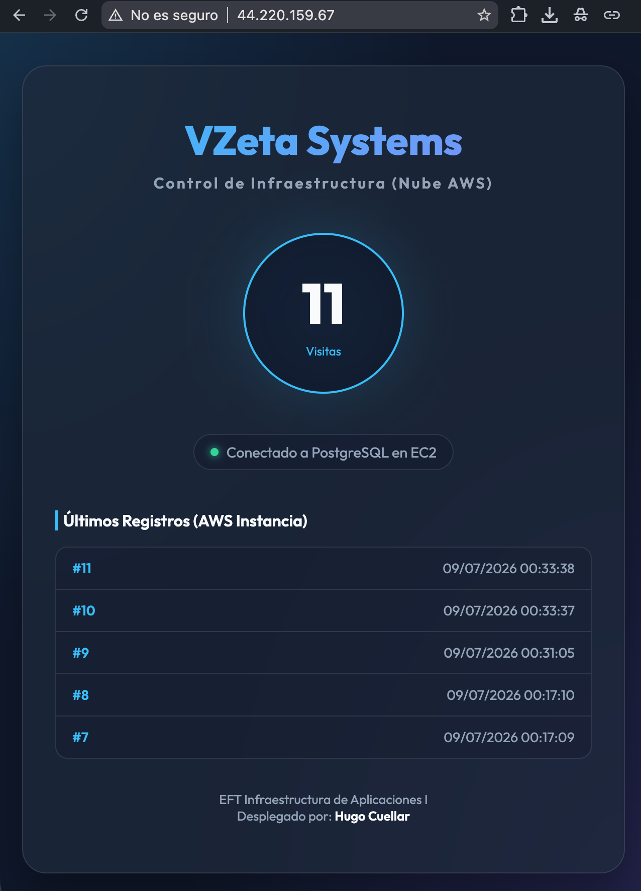
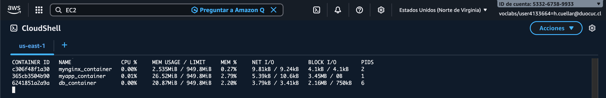

# Examen Final Transversal INY1105 - Infraestructura de Aplicaciones I

Este repositorio contiene el desarrollo de la Evaluación Final Transversal (EFT) de la asignatura **Infraestructura de Aplicaciones I (INY1105)**.

* **Estudiante:** Hugo Cuellar
* **Docente:** Rodrigo Aguilar G.
* **Institución:** Duoc UC
* **Caso de Estudio:** Empresa VZeta - Despliegue de Stack de Servicios Contenerizados

---

## 1. Justificación Técnica

### 1.1. Comparativa de Virtualización: Hipervisores vs. Contenedores
Para optimizar la infraestructura de VZeta, es vital entender las diferencias operativas y de licenciamiento entre la virtualización tradicional y la contenerización:

| Característica | Virtualización Tradicional (Hipervisores) | Contenerización (Docker / Contenedores) |
| --- | --- | --- |
| **Arquitectura** | Cada Máquina Virtual (VM) incluye su propio Sistema Operativo completo (Guest OS), bibliotecas y la aplicación, ejecutándose sobre un Hipervisor (Bare-metal tipo 1 como VMware ESXi / Proxmox, o tipo 2 como VirtualBox). | Los contenedores comparten el núcleo (kernel) del Sistema Operativo Host. Solo empaquetan la aplicación y sus dependencias de usuario directas. |
| **Consumo de Recursos** | **Alto:** Una VM vacía consume gigabytes de RAM y disco solo para inicializar su propio sistema operativo. El overhead de emulación es significativo. | **Bajo:** Consumo de recursos casi nativo. Un contenedor puede pesar pocos megabytes y arrancar en milisegundos. |
| **Instalación y Gestión** | **Compleja:** Requiere instalar el hipervisor, aprovisionar recursos fijos de hardware, instalar el SO invitado, parches de seguridad independientes y herramientas de red complejas. | **Simple:** Se instala Docker Engine en el SO host (`dnf install docker`). A partir de ahí, cualquier imagen se levanta de forma estandarizada. |
| **Licenciamiento** | **Costoso / Rígido:** Licencias basadas en núcleos físicos (ej. Windows Server) o esquemas de suscripción muy costosos tras cambios corporativos (ej. VMware vSphere). | **Abierto / Flexible:** Docker Engine es open-source (Apache 2.0). Existen opciones Enterprise, pero la base comunitaria no incurre en costos de licencia. |
| **Ejemplo Concreto** | Ejecutar un servidor Linux Ubuntu completo consumiendo 1.5 GB de RAM fijos para hostear una pequeña aplicación Flask. | Levantar la misma aplicación Flask en un contenedor Docker compartiendo los recursos dinámicamente con el Host, consumiendo menos de 50 MB de RAM. |

**Para el caso de VZeta:** Docker y Docker Compose se perfilan como la mejor opción debido al bajo consumo de recursos y la rapidez con la que se puede replicar el entorno de desarrollo a producción de manera idéntica.

### 1.2. Propuesta Tecnológica: Entornos de Nube
Considerando los requerimientos de disponibilidad y control de VZeta, analizamos los diferentes esquemas de nube para su despliegue final:

1. **Nube Pública (ej. AWS, Azure, GCP):**
   * *Ventajas:* Alta disponibilidad geográfica, escalabilidad elástica automatizada (pago por uso), nulo mantenimiento de hardware físico.
   * *Desventajas:* Costos variables difíciles de predecir (egreso de datos, peticiones API), dependencia estricta de la conectividad y políticas del proveedor.
   * *Caso VZeta:* El despliegue de la instancia EC2 con Docker representa una implementación de Nube Pública muy ágil para prototipos rápidos y pruebas académicas.

2. **Nube Privada (on-premise con Proxmox / OpenStack):**
   * *Ventajas:* Control absoluto sobre los datos físicos, cumplimiento estricto de regulaciones locales de privacidad, costos predecibles a largo plazo (inversión CapEx inicial).
   * *Desventajas:* Requiere personal técnico especializado para mantenimiento del hardware, actualizaciones físicas e infraestructura local (aire acondicionado, energía redundante).

3. **Nube Híbrida (Recomendación Final para VZeta):**

### 1.3. Estrategia de Integración y Despliegue Continuo (CI/CD)
Para garantizar un flujo ágil y profesional, la solución implementa un flujo automatizado a través del script unificado `./VZeta.sh`:
* **Integración Continua (CI):** Todo el código se gestiona de forma centralizada en GitHub. Al iniciar la automatización, se validan los archivos de configuración y se ejecuta una construcción automatizada (`docker build`) de las imágenes locales (`vzeta-myapp_container` y `vzeta-mynginx_container`) a partir de sus respectivos `Dockerfiles` personalizados, evitando compilaciones manuales y garantizando la integridad de cada componente.
* **Despliegue Continuo (CD):** El script automatiza completamente el aprovisionamiento de la infraestructura en la nube (Security Group, reglas de puertos 80/22, e instancia EC2) y realiza la transferencia del stack para levantarlo en paralelo mediante `docker compose up -d` en un solo paso, eliminando la intervención manual y garantizando la repetibilidad del despliegue.

---

## 2. Descripción de la Arquitectura del Stack

El stack está diseñado bajo una arquitectura de microservicios de tres capas aisladas dentro de una red interna de tipo bridge:

```
[ Cliente (Internet) ] 
         │ (HTTP Puerto 80)
         ▼
┌────────────────────────────────────────────────────────┐
│ Instancia EC2 (AWS Learner Lab - Nube Pública)         │
│                                                        │
│   ┌────────────────────────────────────────────────┐   │
│   │ Red Docker (red_vzeta - Driver Bridge)         │   │
│   │                                                │   │
│   │  [ mynginx_container ] (NGINX Reverse Proxy)   │   │
│   │         │ (Redirección interna puerto 5000)    │   │
│   │         ▼                                      │   │
│   │  [ myapp_container ] (Flask - Imagen propia)   │   │
│   │         │ (Conexión interna TCP 5432)          │   │
│   │         ▼                                      │   │
│   │  [ db_container ] (PostgreSQL 16)              │   │
│   │         │                                      │   │
│   └─────────┼──────────────────────────────────────┘   │
│             │ (Persistencia de datos)                  │
│             ▼                                          │
│      [ Directorio Local Host: ./postgres_data ]        │
└────────────────────────────────────────────────────────┘
```

* **Capa 1: Reverse Proxy (`mynginx_container`)**: Expuesto al exterior en el puerto 80 del host. Recibe las peticiones HTTP del cliente y las reenvía internamente al contenedor Flask en `http://myapp_container:5000`.
* **Capa 2: Aplicación (`myapp_container`)**: Servidor web Python con Flask (construido desde el `Dockerfile` personalizado con base `python:3-slim`). Recibe la petición, realiza una consulta a la base de datos para registrar la visita e incrementa el contador de visitas.
* **Capa 3: Base de Datos (`db_container`)**: Motor de base de datos PostgreSQL 16. Utiliza un **Bind Mount** en el host local apuntando a `./postgres_data` para garantizar la persistencia de las visitas acumuladas, aun si los contenedores se destruyen o la instancia EC2 se reinicia.
* **Redes y Almacenamiento (IE 2.4.1)**: Todo el tráfico viaja encriptado/aislado dentro de la red Docker virtual `red_vzeta` usando el driver `bridge`. El almacenamiento se desacopla mediante el bind mount local configurado con permisos seguros de lectura/escritura (`chmod 777`).

---

## 3. Guía de Despliegue Paso a Paso

Para desplegar la solución en AWS, se recomienda ejecutar el script unificado directamente desde **AWS CloudShell** (donde la consola cuenta con credenciales automáticas y preconfiguradas). Para iniciar, clona el repositorio, accede al directorio del proyecto y otorga permisos de ejecución:

```bash
# 1. Clonar el repositorio
git clone https://github.com/hcuellar-cl/iny1105-eft-hugo-cuellar.git

# 2. Acceder al directorio del proyecto
cd iny1105-eft-hugo-cuellar

# 3. Otorgar permisos de ejecución al script unificado
chmod +x VZeta.sh

# 4. Iniciar el portal de despliegue interactivo
./VZeta.sh
```

El script mostrará un menú interactivo con las siguientes opciones:

1. **Desplegar / Despliegue Activo (IP) - Conectar vía SSH:**
   * Si no hay despliegue activo, lanza y aprovisiona la instancia EC2 y el stack de contenedores de forma automatizada en AWS.
   * Si detecta un despliegue activo, muta dinámicamente mostrando la IP pública y permitiendo iniciar la conexión SSH interactiva y automática hacia la máquina remota al seleccionarla.
2. **Limpieza y eliminación despliegue:**
   * Termina la instancia EC2 y elimina el Security Group creado (así como la IP elástica asociada) para liberar recursos en AWS Learner Lab.
3. **Salir**

---

## 4. Evidencias

### 4.1. Instancia EC2 Creada
Captura de la consola de AWS EC2 mostrando la instancia activa (vzeta-stack-eft), con su IP pública visible y en estado En ejecución.


### 4.2. Docker y Docker Compose Operativos
Captura del terminal de la EC2 mostrando la ejecución exitosa de `docker --version`


### 4.3. Construcción de Imágenes Personalizadas
Salida en terminal de `docker images`, evidenciando las imágenes locales creadas: `vzeta-myapp_container` y `vzeta-mynginx_container`.


### 4.4. Stack de Servicios Levantado
Salida de `docker ps` demostrando el correcto funcionamiento en paralelo de los contenedores `db_container`, `myapp_container` y `mynginx_container`.


### 4.5. Persistencia del Contador de Visitas
Captura del navegador web tras reiniciar el stack (ej. `docker compose restart`), demostrando que el número de visitas persiste y continúa incrementándose en lugar de reiniciarse a 1.


### 4.6. Inspección de Volúmenes y Red
Salida del comando `docker inspect db_container` enfocada en la sección **Mounts** (evidenciando el Bind Mount local) y `docker inspect` de la red `red_vzeta`.


### 4.7. Cliente Web Operativo
Evidencia web abierta en el navegador usando la dirección IP pública de la instancia EC2 mostrando el portal de visitas con el contador.


### 4.8. Ejecución del Ciclo de Vida
Se puede usar la Opción 1 de `./VZeta.sh` (con la IP activa) para conectarse por SSH a la instancia EC2 y realizar pruebas del ciclo de vida manualmente, con comandos como `docker stats`, `docker stop`, `docker restart`, etc.

